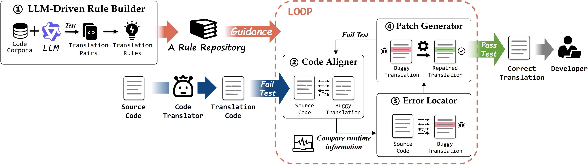

# Artifact for the Paper "RulER: Automated Rule-Based Semantic Error Localization and Repair for Code Translation"

This is the artifact for the paper "***RulER**: Automated Rule-Based Semantic Error Localization and Repair for Code Translation*". This artifact supplies the replication package and the dataset of the paper.

## This artifact contains:
* [Introduction](#introduction)
* [Setup](#setup)
* [Dataset](#dataset)
* [Scripts](#scripts)
* [Usage Instruction](#usage-instruction)


## Introduction

**RulER** is an automated tool designed to address semantic errors in code translation through rule-based localization and repair.




## Setup
**To replicate the experiments, please follow these steps to prepare the necessary dependencies:**

- **Prepare a python environment:**
  - Execute the following commands:
    ```python
    conda create -n RulER python=3.8
    conda activate RulER
    pip install -r requirements.txt
    ```
  - Specifically, the following libraries in [**`requirements.txt`**](requirements.txt) will be installed:
    ```python
    matplotlib==3.10.3
    matplotlib_venn==1.1.2
    nltk==3.8.1
    openai==1.84.0
    pexpect==4.9.0
    python_Levenshtein==0.27.1
    strsimpy==0.2.1
    tqdm==4.66.4
    tree_sitter==0.20.0
    ```
- **Download Project_CodeNet.tar.gz from https://developer.ibm.com/data/project-codenet/ and unzip it.**
- **Download DATABASE.zip from from https://drive.google.com/file/d/1JPtnvnBULlZpgd-1uHTUOZtfDo1DVpRq/view?usp=sharing and unzip it into **`/data/DATABASE`**.**

## Dataset

**The code translation rules generated by RulER and datasets needed for the experiment are stored in the [`/data/DATABASE`](data/DATASET). Detailed information illustrating the structure and contents of our released dataset is provided in [`/data/Data.md`](/data/Data.md).**

Structure of [**`/data/DATABASE`**](DATABASE):
```
/data/DATABASE
┝━━ DATA/
│   ┝━━ BUG/ (labels for error localization)
│   ┝━━ CODE/ (code translations with semantic errors)
│   ┕━━ MAP/ (labels for code alignments)
┝━━ task-5000-qwen2.5-coder-32b-instruct-CodeNet-C++-Java/ (original C++-to-Java translation rules)
┝━━ task-5000-qwen2.5-coder-32b-instruct-CodeNet-C++-Java-new/ (newly constructed C++-to-Java translation rules)
┝━━ task-5000-qwen2.5-coder-32b-instruct-CodeNet-C++-Python/ (original C++-to-Python translation rules)
┝━━ task-5000-qwen2.5-coder-32b-instruct-CodeNet-C++-Python-new/ (newly constructed C++-to-Python translation rules)
┝━━ task-5000-qwen2.5-coder-32b-instruct-CodeNet-Java-C++/ (original Java-to-C++ translation rules)
┝━━ task-5000-qwen2.5-coder-32b-instruct-CodeNet-Java-C++-new/ (newly constructed Java-to-C++ translation rules)
┝━━ task-5000-qwen2.5-coder-32b-instruct-CodeNet-Python-C++/ (original Python-to-C++ translation rules)
┕━━ task-5000-qwen2.5-coder-32b-instruct-CodeNet-Python-C++-new/ (newly constructed Python-to-C++ translation rules)
```

## Scripts

**We provide scripts to reproduce our experiment results in the [`/scripts`](scripts) folder.** 

Structure of [**`/scripts`**](scripts) folder:
```
scripts
┝━━ Module1-LLM-DrivenRuleBuilder/
┝━━ Module2-CodeAligner/
┝━━ Module3-ErrorLocator/
┝━━ Module4-PatchGenerator/
┝━━ RQ1/
┝━━ RQ2/
┝━━ RQ3&RQ4/
┝━━ RunTrace/
┕━━ Test/
```

# Usage Instruction

**We provide scripts to run RulER and reproduce all experimental results from RQ1 to RQ4.**

## Follow these steps to use RulER.

### 1. LLM-driven Rule Builder of RulER: 

+ ***Note:** We do not recommend reproducing this module due to high time costs; execution results are already provided in [`DATABASE.zip`](https://drive.google.com/file/d/1JPtnvnBULlZpgd-1uHTUOZtfDo1DVpRq/view?usp=sharing).*

Run the following commands to extract code translation rules from translations generated by LLM qwen2.5-coder-32b-instruct (requires an api_key from https://www.aliyun.com/).

  ```bash
cd scripts/Module1-LLM-DrivenRuleBuilder

python step1-translate_codenet.py \
--source_lang source-programming-language \
--target_lang target-programming-language \
--tmp_dir tmp \
--CodeNet_data_path path/to/Project_CodeNet/data \
--model_name qwen2.5-coder-32b-instruct \
--CodeNet_test_input_path path/to/Project_CodeNet/derived/input_output/data \
--path_to_save_source_code CodeNet_sourcefiles \
--api_key api_key_of_qwen2.5-coder-32b-instruct

python step2-test_codenet.py \
--source_lang source-programming-language \
--target_lang target-programming-language \
--CodeNet_test_input_path path/to/Project_CodeNet/derived/input_output/data \
--tmp_dir tmp \
--model_name qwen2.5-coder-32b-instruct

python step3-delete_codenet.py \
--source_lang source-programming-language \
--target_lang target-programming-language \
--model_name qwen2.5-coder-32b-instruct \
--path_to_save_source_code CodeNet_sourcefiles

python step4-test_codenet.py \
--source_lang source-programming-language \
--target_lang target-programming-language \
--model_name qwen2.5-coder-32b-instruct \
--CodeNet_test_input_path path/to/Project_CodeNet/derived/input_output/data \
--tmp_dir tmp

python step5-translate_codenet.py \
--source_lang source-programming-language \
--target_lang target-programming-language \
--model_name qwen2.5-coder-32b-instruct \
--api_key api_key_of_qwen2.5-coder-32b-instruct

python step6-test_codenet.py \
--source_lang source-programming-language \
--target_lang target-programming-language \
--model_name qwen2.5-coder-32b-instruct \
--tmp_dir tmp

python step7-build_maps.py \
--source_lang source-programming-language \
--target_lang target-programming-language \
--model_name qwen2.5-coder-32b-instruct
  ```

### 2. Loop Execution of Code Aligner, Error Locator, and Patch Generator of RulER:

#### The first round execution:

**(1)** Execute the following command to run Code Aligner for the evaluation dataset.

  ```bash
cd scripts/Module2-CodeAligner

python run.py \
--source_lang source-programming-language \
--target_lang target-programming-language \
--target_model_name name_of_the_target_translator_such_as_TransCoder_TransCoderST_Codex_Qwen2.5-Coder-32B-Instruct-data \
--model_name qwen2.5-coder-32b-instruct \
--path_to_code path/to/DATABASE/DATA/CODE \
--path_to_save_map_for_line path/to/save/maps/for/lines \
--path_to_save_map_for_statement path/to/save/maps/for/statements \
--path_to_DATABASE path/to/DATABASE
  ```
  

**(2)** Execute the following command to run Error Locator for the evaluation dataset.

  ```bash
cd scripts/Module3-ErrorLocator

python run.py \
--source_lang source-programming-language \
--target_lang target-programming-language \
--target_model_name one_of_TransCoder_TransCoderST_Codex_Qwen2.5-Coder-32B-Instruct-data \
--model_name qwen2.5-coder-32b-instruct \
--path_to_map path/to/maps/for/lines \
--path_to_save_FL path/to/save/fault/localization/results \
--path_to_label path/to/DATABASE/DATA/BUG \
--path_to_code path/to/DATABASE/DATA/CODE \
--path_to_DATABASE path/to/DATABASE
  ```
  

**(3)** Execute the following command to run Patch Generator for the evaluation dataset.

  ```bash
cd scripts/Module4-PatchGenerator

python run.py \
--source_lang source-programming-language \
--target_lang target-programming-language \
--target_model_name one_of_TransCoder_TransCoderST_Codex_Qwen2.5-Coder-32B-Instruct-data \
--model_name qwen2.5-coder-32b-instruct \
--path_to_map path/to/maps/for/lines \
--path_to_stmtmap path/to/maps/for/statements \
--path_to_code path/to/DATABASE/DATA/CODE \
--path_to_fixcode path/to/save/repaired/translations \
--path_to_DATABASE path/to/DATABASE
  ```

**(4)** Execute commands below to verify the patches generated by Patch Generator. The verification results will be stored in files within the **`/Info`** folder.

  ```bash
cd scripts/Test

python step1-fill_script.py \
--path_to_fixcode path/to/save/repaired/translations \
--path_to_DATABASE path/to/DATABASE

python step2-rewrite_script.py

python step3-rewrite_script_of_originalcode.py \
--path_to_DATABASE path/to/DATABASE

python step4-test_script.py \
--source_lang source-programming-language \
--target_lang target-programming-language \
--target_model_name one_of_TransCoder_TransCoderST_Codex_Qwen2.5-Coder-32B-Instruct-data \
--tmp_dir tmp

python step5-test_uncompare_script.py \
--source_lang source-programming-language \
--target_lang target-programming-language \
--target_model_name one_of_TransCoder_TransCoderST_Codex_Qwen2.5-Coder-32B-Instruct-data \
--tmp_dir tmp

python step6-collect_unfix.py \
--path_to_DATABASE path/to/DATABASE
  ```

#### The N round execution, where N>=2:


**(1)** Execute the following command to run the translation code and obtain runtime information.

  ```bash
cd scripts/RunTrace

python step1-copy_sourcetrace.py \
--path_to_code CODE-roundX \
--path_to_DATABASE path/to/DATABASE

python step2-extract_trace.py \
--source_lang source-programming-language \
--path_to_code CODE-roundX \
--path_to_DATABASE path/to/DATABASE \
--target_model_name one_of_TransCoder_TransCoderST_Codex_Qwen2.5-Coder-32B-Instruct-data \
--tmp_dir tmp

python step3-update_C++_lineID.py \
--path_to_code CODE-roundX

python step4-rephrase_var.py \
--path_to_code CODE-roundX
  ```

**(2)** Execute the following command to run Code Aligner for evaluation dataset.

  ```bash
cd scripts/Module2-CodeAligner

python run.py \
--source_lang source-programming-language \
--target_lang target-programming-language \
--target_model_name name_of_the_target_translator_such_as_TransCoder_TransCoderST_Codex_Qwen2.5-Coder-32B-Instruct-data \
--model_name qwen2.5-coder-32b-instruct \
--path_to_code path/to/CODE-roundX \
--path_to_save_map_for_line path/to/save/maps/for/lines \
--path_to_save_map_for_statement path/to/save/maps/for/statements \
--path_to_DATABASE path/to/DATABASE
  ```
  

**(3)** Execute the following command to run Error Locator for evaluation dataset.

  ```bash
cd scripts/Module3-ErrorLocator

python run.py \
--source_lang source-programming-language \
--target_lang target-programming-language \
--target_model_name one_of_TransCoder_TransCoderST_Codex_Qwen2.5-Coder-32B-Instruct-data \
--model_name qwen2.5-coder-32b-instruct \
--path_to_map path/to/maps/for/lines \
--path_to_save_FL path/to/save/fault/localization/results \
--path_to_label path/to/DATABASE/DATA/BUG \
--path_to_code path/to/CODE-roundX \
--path_to_DATABASE path/to/DATABASE
  ```
  

**(4)** Execute the following command to run Patch Generator for evaluation dataset.

  ```bash
cd scripts/Module4-PatchGenerator

python run.py \
--source_lang source-programming-language \
--target_lang target-programming-language \
--target_model_name one_of_TransCoder_TransCoderST_Codex_Qwen2.5-Coder-32B-Instruct-data \
--model_name qwen2.5-coder-32b-instruct \
--path_to_map path/to/maps/for/lines \
--path_to_stmtmap path/to/maps/for/statements \
--path_to_code path/to/CODE-roundX \
--path_to_fixcode path/to/save/repaired/translations \
--path_to_DATABASE path/to/DATABASE
  ```

**(5)** Execute commands below to verify the patches generated by Patch Generator. The verification results will be stored in files within the **`/Info`** folder.

  ```bash
cd scripts/Test

python step1-fill_script.py \
--path_to_fixcode path/to/save/repaired/translations \
--path_to_DATABASE path/to/DATABASE

python step2-rewrite_script.py

python step3-rewrite_script_of_originalcode.py \
--path_to_DATABASE path/to/DATABASE

python step4-test_script.py \
--source_lang source-programming-language \
--target_lang target-programming-language \
--target_model_name one_of_TransCoder_TransCoderST_Codex_Qwen2.5-Coder-32B-Instruct-data \
--tmp_dir tmp

python step5-test_uncompare_script.py \
--source_lang source-programming-language \
--target_lang target-programming-language \
--target_model_name one_of_TransCoder_TransCoderST_Codex_Qwen2.5-Coder-32B-Instruct-data \
--tmp_dir tmp

python step6-collect_unfix.py \
--path_to_DATABASE path/to/DATABASE
  ```

## Follow these steps to reproduce evaluation results in RQ1, RQ2, RQ3, and RQ4.

### 1. RQ1: How does RulER compare to existing methods for constructing code alignments?

Execute below instructions to generate evaluation results of RQ1.

  ```bash
cd scripts/RQ1
python evaluate.py
  ```

### 2. RQ2: How does RulER compare to existing methods for locating semantic errors?

Execute below instructions to generate evaluation results of RQ2.

  ```bash
cd scripts/RQ2
python evaluate.py
  ```

### 3. RQ2 and RQ3: Effectiveness of RulER and existing methods for repairing semantic errors?

**RQ2:** How does RulER compare to BatFix for repairing semantic errors?

**RQ3:** How does the Mined Rule-Driven Patch Generator module compare to LLM for generating repair patches?

Execute below instructions to generate evaluation results of RQ3 and RQ4.

  ```bash
cd scripts/RQ3&RQ4
python evaluate.py
  ```

## Contact
If you have questions, suggestions and bug reports, please email imjinshuo@whu.edu.cn.